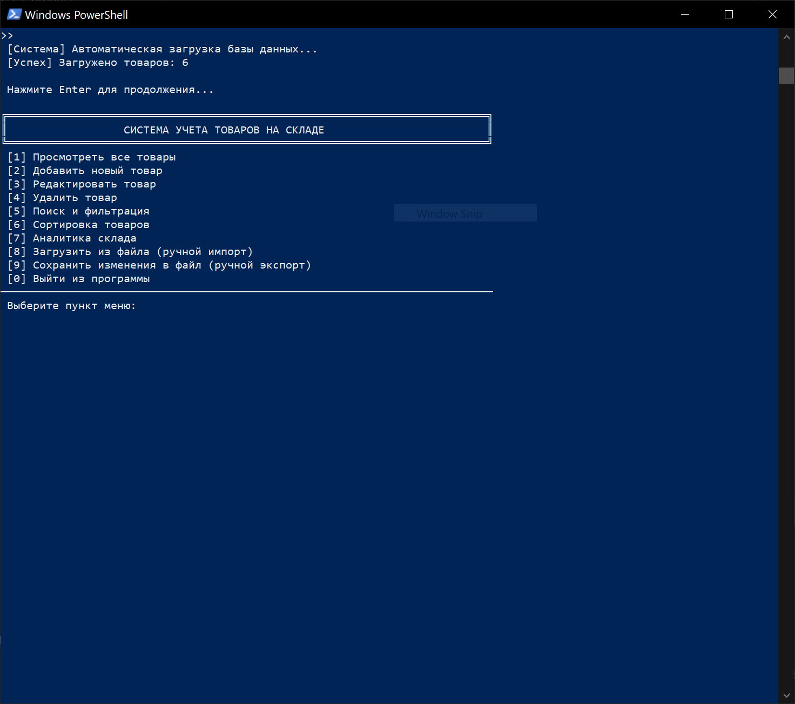
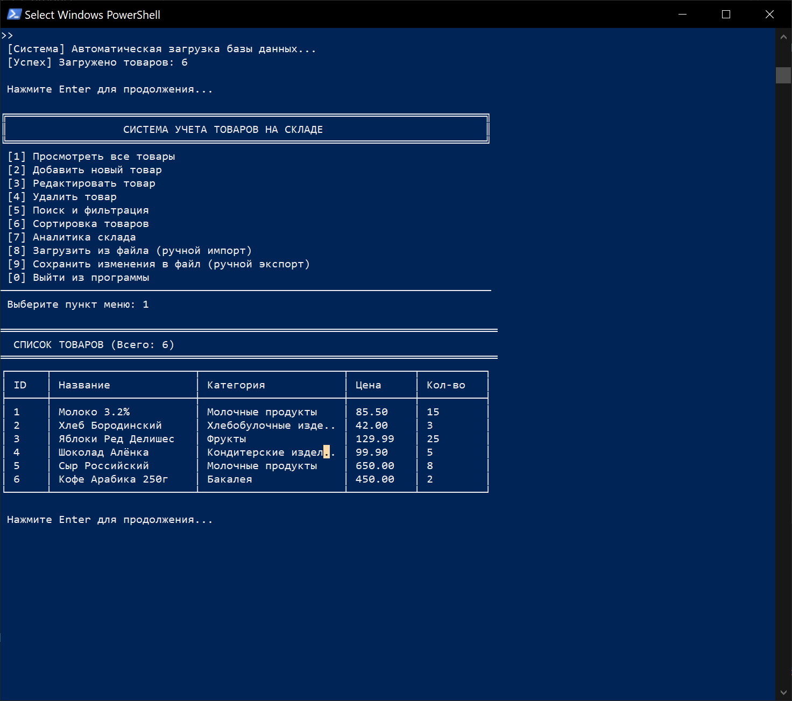
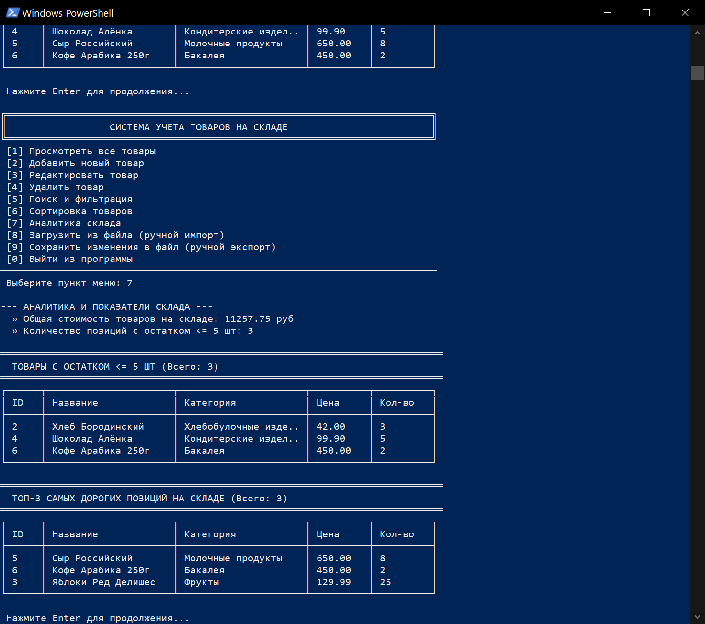

# Отчет по лабораторной работе - "Учёт товаров на складе"

## Информация об авторе и проекте
* **ФИО:** `Беляев Андрей Дмитриевич`
* **Группа:** `КС-392`
* **Стиль написания кода:** CPP Core Guidelines
* **Язык программирования:** C++ 17

---

## 1. Цель работы
Закрепить навыки объектно-ориентированного программирования, работы со стандартной библиотекой STL, файлового ввода-вывода (потоки `fstream`), проектирования модульных приложений на языке C++ и организации защищенного пользовательского ввода

## 2. Постановка задачи
Разработать консольное приложение для автоматизации учета товаров на складе. Программа должна предоставлять интерфейс для управления записями товаров, выполнять валидацию данных, осуществлять гибкий поиск, фильтрацию, сортировку по различным критериям, рассчитывать аналитические показатели склада, а также автоматически загружать и сохранять данные в текстовом формате CSV (разделитель — запятая)

---

## 3. Технические требования
* **Стандарт языка:** C++ 17 или выше
* **Компилятор:** Любой современный компилятор с поддержкой C++ 17
* **Система сборки:** CMake (версия 3.10 или выше)
* **Хранение данных в памяти:** Динамический контейнер `std::vector<Product>`
* **Формат хранения на диске:** Текстовый файл `data/products.txt` с разделителем `,` (формат строки: `id,name,category,price,quantity`)
* **Обработка ошибок:** Полностью безопасный ввод без аварийного завершения работы программы

---

## 4. Структура проекта
Проект организован по модульному принципу:
```text
WarehouseApp/
├── CMakeLists.txt        # Файл конфигурации сборки CMake
├── README.md             # Отчет и инструкция по проекту (этот файл)
├── .gitignore            # Исключение временных файлов компиляции
├── data/
│   └── products.txt      # Текстовая база данных товаров (с автозагрузкой)
├── screenshots/          # Скриншоты работы приложения для отчета
│   ├── main_menu.PNG
│   ├── all_stuff.PNG
│   └── analytics.PNG
└── src/
    ├── Product.h         # Описание класса товара (поля и валидация)
    ├── Product.cpp       # Реализация валидации и методов товара
    ├── Warehouse.h       # Управление коллекцией товаров (поиск, сортировка, аналитика)
    ├── Warehouse.cpp     # Реализация алгоритмов STL и логики склада
    ├── FileIO.h          # Интерфейс сохранения и чтения текстовых файлов
    ├── FileIO.cpp        # Реализация отказоустойчивого парсинга CSV
    ├── Menu.h            # Меню, разметка консоли и безопасный ввод
    ├── Menu.cpp          # Реализация интерфейса, кодировки UTF-8 и табличной сетки
    └── main.cpp          # Точка входа в приложение, проверка директорий
```

---

## 5. Инструкция по установке и запуску локально

### Требования
* Компилятор C++ с поддержкой стандарта C++ 17 (MSVC 2017+, GCC 7+, Clang 5+)
* Установленная система сборки CMake (3.10+)

### Способ 1: Сборка и запуск через консоль (PowerShell / Windows)
Для удобной сборки через консоль на Windows рекомендуется использовать компилятор GCC из окружения **MSYS2**:
1. Откройте PowerShell в корневой папке проекта.
2. Подключите путь к установленному компилятору и утилитам сборки (например, MSYS2 UCRT64):
   ```powershell
   $env:PATH = "C:\msys64\ucrt64\bin;C:\msys64\usr\bin;" + $env:PATH
   ```
3. Создайте директорию для сборки и перейдите в неё:
   ```powershell
   mkdir build
   cd build
   ```
4. Сгенерируйте файлы конфигурации CMake (с использованием генератора Ninja или Makefiles):
   ```powershell
   cmake -G "Ninja" ..
   ```
5. Скомпилируйте проект:
   ```powershell
   cmake --build .
   ```
6. Запустите приложение:
   ```powershell
   .\WarehouseApp.exe
   ```

### Способ 2: Открытие и запуск в Visual Studio (для Windows)
1. Запустите Visual Studio.
2. Нажмите **«Открыть локальную папку»** (Open a local folder) и укажите корневую директорию проекта.
3. Visual Studio автоматически просканирует файл `CMakeLists.txt`, выполнит первичную конфигурацию CMake и подготовит проект к сборке.
4. Выберите цель `WarehouseApp.exe` в верхнем меню выбора и нажмите клавишу **F5** (или зеленую стрелку запуска) для автоматической компиляции и старта программы.

---

## 6. Демонстрация работы приложения

1. **Главное меню программы:**
   
2. **Просмотр каталога товаров (ASCII-сетка с кириллицей):**
   
3. **Фильтрация и аналитика (Выгрузка товаров с остатком ≤ 5 шт.):**
   

---
